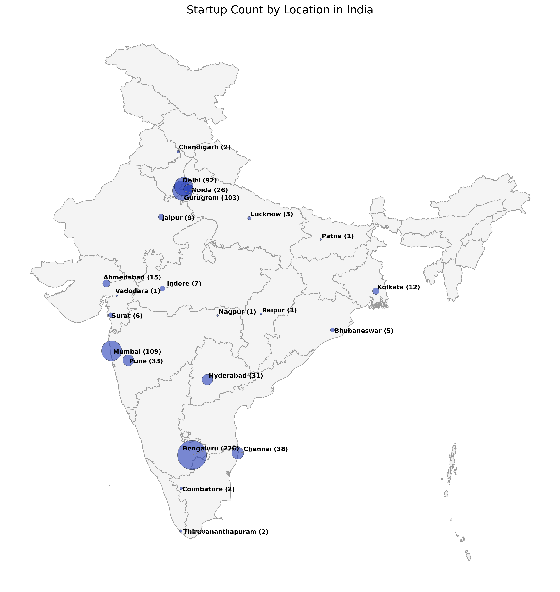

# 2025 Startup Data Analysis and Visualisation

This project is a look into where new businesses are starting up and how they are growing as we head into 2025. Instead of just looking at spreadsheets, data is used to show where the most activity is happening and what the future might look like for new companies.

Data is a great tool for seeing the "big picture." By looking at how many startups are popping up in different areas, it becomes easier to see which industries are becoming popular and which cities are becoming the next big spots for innovation.

## Where things are happening: India's Startup Map

A big part of this study focuses on India. The map below shows how many startups are in each region. It’s a simple way to see that while big cities are still busy, smaller towns are starting to catch up and create their own space in the tech world.

### Key Takeaways from the 2025 Study

The research shows that the Indian startup world is becoming more mature and stable. Rather than just trying to grow as fast as possible, there is a new focus on building businesses that can last.

* **Location is changing:** Bengaluru is still the main center, but new funding is being seen in cities like Bhubaneswar and Surat. This shows that good ideas are starting to come from everywhere, not just one or two big hubs.
* **A move toward "Hard Tech":** A lot of investment is shifting away from simple apps. Instead, more money is going into Space Tech, Defense, and Clean Energy. It seems the next few years will be driven by owning new technology and unique inventions.
* **The Funding Gap:** While there are many small investments in new ideas, the majority of the actual money is still being taken up by a few very large, established companies. This makes it a bit more difficult for mid-sized companies that haven't reached a profit yet.

### Project Resources
* **Data Source:** Information was gathered from the [Indian Startup Funding Data 2025](https://www.kaggle.com/datasets/aniketdash7/indian-startup-funding-data-2025) on Kaggle.
* **Detailed Report:** The full document, *A STUDY ON THE 2025 INDIAN STARTUP FUNDING LANDSCAPE.pdf*, is included in this folder for more specific details on these trends.

### How to use this
1. Copy the project to your computer.
2. Make sure you have python and the necessary packages installed.
3. Open the analysis file to see the data and the maps.

---
*Based on startup info collected from 2025 reports.*